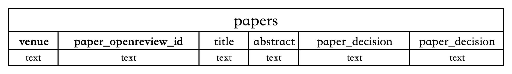
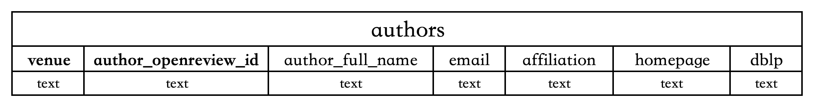
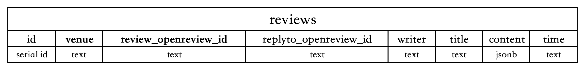
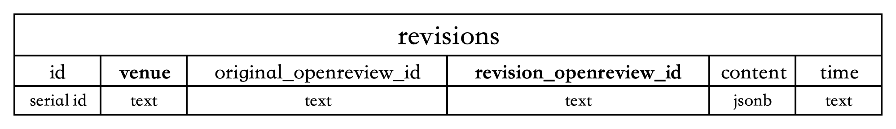
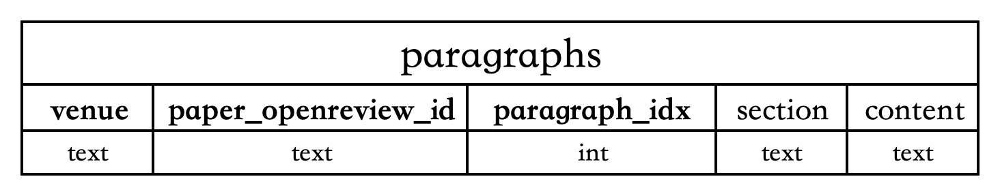
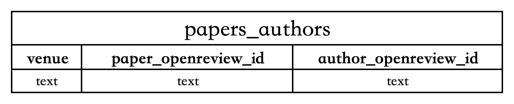
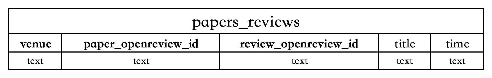
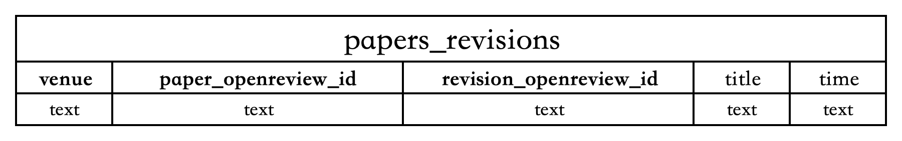
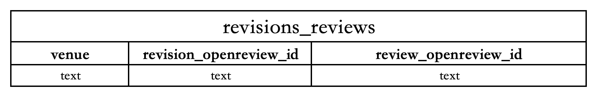

## Database Overview

This database mainly stores the data on **Openreview**, including the `paper`, `authors`, `reviews` and `paper revisions` data of each submission. Moreover, every papers and paper revisions are splitted into `paragraphs`.

Sepecifically, we use **tables** to store data because it can express relational data more conveniently. 

There are two kinds of table: Node tables and Edge tables.

### Node Tables

#### papers

#### authors

#### reviews

#### revisions

#### paragraphs

### Edge Tables

#### papers_authors

#### papers_reviews

#### papers_revisions

#### revisions_reviews

## Construct Database

Here, we provide three ways to construct the database.
- construct the database by **venue id** (based on openreview api, and concurrently we support venue ICLR)
- construct the database by provided **csv file**
- construct the database by provided **json file**

The examples are provided in the `./examples/construct_database` folder.

Importantly, if you want to include the paragraphs information of each paper and paper revision, you should download all the pdfs into a folder beforehand. (examples are in `./examples/get_all_pdfs`) Then, you should provide the folder when constructing the database.

## Supported Functions

In addition to the data itself, we also offer some useful functions to help users retrieve data from the database more conveniently.

### Node-related Functions

The overview of the functions are as follows:

- `get_node_features_by_id(self, table: str, primary_key: dict) -> pd.Dataframe`
- `get_node_features_by_id(self, table: str, primary_key: dict) -> pd.Dataframe`
- `get_all_nodes(self, table: str) -> pd.Dataframe`
- `get_all_node_features(self, table: str) -> pd.Dataframe`
- `get_all_node_features(self, table: str) -> pd.Dataframe`
- `update_node(self, table: str, node_features: dict) -> pd.Dataframe`
- `insert_node(self, table: str, node_features: dict) -> None`

Some examples are provided in folder `/examples/node_test`.

### Edge-related Functions

The overview of the functions are as follows:

- `get_edge_features_by_id(self, table: str, primary_key: dict) -> pd.Dataframe`
- `get_node_features_by_venue(self, table: str, venue: str) -> pd.Dataframe`
- `get_node_features_by_venue(self, table: str, venue: str) -> pd.Dataframe`
- `delete_edge(self, table: str, primary_key: dict) -> pd.Dataframe`
- `delete_edge(self, table: str, primary_key: dict) -> pd.Dataframe`
- `get_neighborhood(self, table: str, primary_key: dict) -> pd.Dataframe`

Some examples are provided in folder `/examples/edge_test`