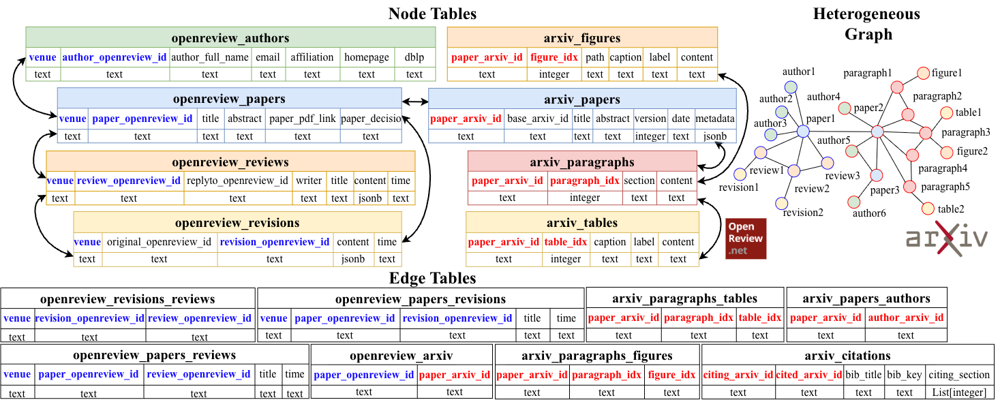

<h1 align="center">🎡 ResearchArcade: Graph Interface for Academic Tasks</h1>

<p align="center">
    <a href="https://ulab-uiuc.github.io/research_arcade/">🌐 Project Page</a> |
    <a href="TODO">📜 arXiv</a>
<p>

<div align="center">

</div>

# 🗞️ News

<!-- # 👋🏻 Introduction

ResearchArcade is a graph interface for academic tasks. It utilizes a coherent multi-table format with graph structures to organize data from different sources and multiple modalities. And it preserves temporal evolution at both the manuscript and community levels. -->

# 🧭 Motivation

Academic data is distributed across multiple platforms (e.g., ArXiv, OpenReview) and modalities (text, figures, tables, reviews). ResearchArcade unifies these heterogeneous data sources into a single graph-based interface to enable large-scale, structured, and temporal analysis of academic dataset.

### Core Features

- **Multi-Source**: ArXiv (Academic Corpora) & OpenReview (Peer Reviews and Manuscript Revisions)
- **Multi-Modal**: Figures and Tables in Academic Corpora
- **Highly Structural and Heterogeneous**: Data can be intuitively viewed as heterogeneous graphs with multi-table format
- **Dynamically Evolving**: Manuscript (Intra-paper) Level (e.g., Paper Revision) & Community (Inter-paper) Level (e.g., Paper Citation with Timestamp)

### Data Illustration



Tables are classified into **node tables** (colored) or **edge tables** (black and white). The blue (denoting the OpenReview part) or red (denoting the ArXiv part) columns represent the unique identification of each node or edge, and the remaining columns represent the features of the nodes or edges. The conversion from the multiple tables to heterogeneous graphs is straightforward.

# 🚀 Get started

### Supported Features

- **Dual Backend Support**: CSV backend & PostgreSQL backend
- **Comprehensive Data**
    - **OpenReview**: Support for papers, authors, reviews, revisions, paragraphs, and their interconnections
    - **ArXiv**: Support for papers, authors, paragraphs, sections, figures, tables and their interconnections
- **Flexible Data Import**: Load data from OpenReview API, Arxiv API, CSV files, or JSON files
- **Graph-like Operations**: Navigate relationships between entities
    - **OpenReview**: authorship (paper-author), comment-under-paper (paper-review), revision-of-paper (paper-revision), revision-caused-by-review (revision-review), etc.
    - **ArXiv**: citationship (paper-paper), authorship (paper-author), paragraph-of-paper (paper-paragraph), figure-of-paper (paper-figure), table-of-paper (paper-table), etc.
- **CRUD Operations**: Full support for Create, Read, Update, and Delete operations on all entities

### ⚙️ Environment Requirements
- Python ≥ 3.9 (tested on 3.12)
- PostgreSQL ≥ 14 (for SQL backend)
- Conda ≥ 22.0 (recommended)
- API keys:
  - Semantic Scholar API
  <!-- - Other APIs of user's choice/convenience -->

```python
# create a new environment
conda create -n research_arcade python=3.12
conda activate research_arcade

# install related libraries
pip install -r requirements.txt
```

### Configure Environment Variables

To run the code, you’ll need to set up environment variables such as your **Semantic Scholar API key** and database configurations.

Copy the template file into the project root directory:
```bash
cp .env.template .env
```

### Backend Selection

#### Initialize with CSV Backend

```python
from research_arcade import ResearchArcade

research_arcade = ResearchArcade(
    db_type="csv",
    config={"csv_dir": "/path/to/csv/data/"}
)
```

#### Initialize with SQL Backend

```python
from research_arcade import ResearchArcade

research_arcade = ResearchArcade(
    db_type="sql",
    config={
        "host": "localhost",
        "dbname": "conference_db",
        "user": "username",
        "password": "password",
        "port": "5432"
    }
)
```

### Core Operations

The following examples demonstrate the core operations available in ResearchArcade. For comprehensive examples covering all supported tables and operations, please refer to the `examples/tutorials.ipynb` file in the repository.

#### Table Construction

```python
# From API
config = {"venue": "ICLR.cc/2025/Conference"}
research_arcade.construct_table_from_api("openreview_papers", config)

# From CSV file
config = {"csv_file": "/path/to/papers.csv"}
research_arcade.construct_table_from_csv("openreview_papers", config)

# From JSON file
config = {"json_file": "/path/to/papers.json"}
research_arcade.construct_table_from_json("openreview_papers", config)
```

#### Query Operations

```python
# Get all entities
papers_df = research_arcade.get_all_node_features("openreview_papers")

# Get specific entity by ID
paper_id = {"paper_openreview_id": "zGej22CBnS"}
paper = research_arcade.get_node_features_by_id("openreview_papers", paper_id)

# Get relationships
paper_authors = research_arcade.get_neighborhood("openreview_papers_authors", paper_id)
```

#### Node Manipulation

```python
# Insert new node
new_author = {
    'venue': 'ICLR.cc/2025/Conference',
    'author_openreview_id': '~john_doe1',
    'author_full_name': 'John Doe',
    'email': 'john@university.edu',
    'affiliation': 'University Name'
}
research_arcade.insert_node("openreview_authors", node_features=new_author)

# Update existing node
updated_paper = {
    'paper_openreview_id': 'paper123',
    'title': 'Updated Title',
    # ... other fields
}
research_arcade.update_node("openreview_papers", node_features=updated_paper)

# Delete a node
review_id = {"review_openreview_id": "review456"}
research_arcade.delete_node_by_id("openreview_reviews", review_id)
```

#### Edge Manipulation

```python
# Create an edge
paper_author_edge = {
    'venue': 'ICLR.cc/2025/Conference',
    'paper_openreview_id': 'paper123',
    'author_openreview_id': '~john_doe1'
}
research_arcade.insert_edge("openreview_papers_authors", paper_author_edge)

# Delete an edge
research_arcade.delete_edge_by_id("openreview_papers_authors", paper_author_edge)
```

# Contribution

We’re working on extending support for data and operations. Contributions welcome!

# Acknowledgements
This project builds on open academic infrastructures such as ArXiv and OpenReview. 

# License

This project is licensed under the MIT License – see the [LICENSE](./LICENSE) file for details.


# Citation

